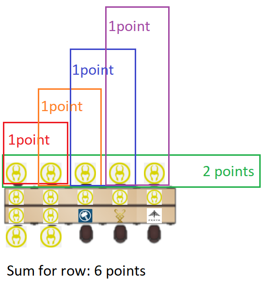

# Open office challenge

In this challenge the goal is to create an algorithm that finds the ideal flexi-desk seating for an open office

## Story and setup

We have 4 tables, each table with 2 rows, each row consisting of 5-5 seats.
We have infinite employees of which every day __43__ come to the office, each working in one of our 6 teams, arriving at the office one-by-one. We need to tell each of them where to sit. We can also decide to send them home, but the office is costly, so every vacant seats will yield a penalty.

All seats have a setup from the previous day, each team sets up their desks ever so differently. Team members are happy to sit where they don't need to start the day with setting everything up. If they do sit at such positions, they create their team's setup there, hence the next day that is going to wait for anybody sitting there.

All people are different, and all employees have their seat preferences. There are places in the office they like to sit, and places they don't fancy. Watch out for the weird guy, he likes only a few seats in the office.

Team members also like to sit together, but the company also believes in diversity, thus both members sitting together and having mixed rows yield various rewards.

Team Leads don't like to sit at the right end of the rows, they get too much distractions there, which spoils their mood, and by association their mood spreads to the whole row.

Since it is a very lean company, if the seating situation is dire the office manager can shout out KAIKAKU, which sends home the last seated member, who is happy to adapt to changes. This cannot occur more than once a day, that would lower the moral regardless of how lean this company is.

## Manual

You need to extend solver.js. There is `initializeSolver` which is called each "day" to let you reinitialize global variables used. The other function is `getNextSeat` this is called with the employee arriving at the office and with the current seating situation of the office and needs to return one of:
- return the seat to sit the employee, and optionally kaikaku true, once per day (once between 2 `initializeSolver` calls), note that the seat can be the same as the one being vacated by kaikaku
- return undefined to send home the employee
- return undefined for the seat and kaikaku true, to send home both the employee that has arrived and the one last seated.

kaikaku=true sends home the employee last seated. NOTE: the seat left empty will be set up for the team whose member leaving it! <br/><br/>
Members have a seat preference function, this tells you how happy they are with a given seat. <br/>
`setupForTeam` value tells what setup the seat currently has, it is first random, but then saved between days, so after `initializeSolver` is called again, it will have the same setup as `teamName` of the employee sitting there the previous day, or the initial value if nobody sat there.

We will run your solution for 10 000 days (meaning 10 000 `initializeSolver` calls) and each day `getNextSeat` will be called up to 43 times (when all seats are taken, the remaining employees are sent home automatically).

### **An example solver is provided, you can run your solution by opening simulator.html**

Table, and team member data structure:

```typescript
type TeamMember =  {
          teamName: string,
          isManager: boolean,
          seatPreference: (seat) => number, // seat is in the form of { tableId: number, rowId: number, seatId: number }
        };
type Seat = {
        member: TeamMember,
        setupForTeam: string, // one of the team names from TEAMS
      };
type Row = Seat[]; // length === 5
type Table = Row[]; // length === 2
type Office = Table[]; // length === 4
```

Expected return type for `getNextSeat`

```typescript
{
  seat? : { tableId: number, rowId: number, seatId: number },
  kaikaku?: boolean
} | undefined
```

Feel free to use the following constants in your code, they are on the global scope:
```javascript
const NUMBER_OF_EMPLOYEES = 43;
const NUMBER_OF_TABLES = 4;
const TEAMS = { 0: "Loki", 1: "Berserkers", 2: "Sindri", 3: "Thor", 4: "Freya", 5: "Yggdrasil" };
```

### Randomization and odds
The chance for an arriving employee to be from a given team is equally 1/6 for each teams. <br/>
The chance of the arriving employee to be a Team Lead is 1/20. There are inifinite number of employees for 6 teams so there might be multiple TLs for the same team, even on the same day! <br/>
Seats are preset to a random team at the beginning, but after that they keep the setup of the employee last sitting there (so no randomization between days). <br/>
There are 4 types of seat preferences, chosen randomly for each employee, but not with equal chance, actually using double randomization, but generally the preferences with their weighs:
| Preference | Odds |
| ---------- | ---- |
| front      | 0.4  |
| back       | 0.4  |
| window     | 0.2  |
| weirdGuy   | 0.05 |
For front preference, the closer you are to the 0th table, the happier the employee, for back preference it's the reverse, and for window preference, the closer to the 0th seat the happier. Weird guy likes random seats, but s/he likes them very much (3 points worth so). Detailed preferences can be obtained through calling the preference function with a seat on a `member`(teammember a.k.a. employee) object, or check out [the code](./src/preference-functions.js).

## Scoring

- Every empty seat: -1
- Every employee sitting at a desk that had been set up for her team: +1
- TeamLead sitting at the right end of a row: maximum 0 points can be achieved for that row (still can be negative)
- For every employee their preference number at their chosen seat (be it positive or negative), this ranges from -2 to 3
- 2 members of the same team sitting next to each other: +1 / duo
- 4+ members of the same team sitting next to each other: +2 / row (e.g. if only 1 team sits at 10 seat of a table, that's 4 points from this category)
- no 2 employees sitting next to each other in the row are in the same team: +2 / row
- for every if the employee sitting at the end of the row (rowN[4]) is a manager (Team Lead) and that row would yield positive score, it is nulled. negative summ score of the row still counts

Example row point counting: <br/>



